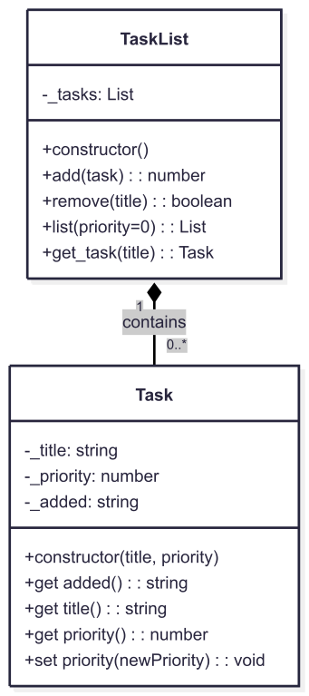

# TaskList App

A minimum viable product (MVP) Tasklist application implementing an object-oriented design with two main classes.

## Overview

The application consists of two key classes that work together:

- `TaskList`: Manages a collection of task items
- `Task`: Represents individual task items

The relationship between these classes is one-to-many: a single `TaskList` instance can manage multiple `Task` instances.

## Class Diagram



## Helper Functions

The system requires three helper functions:

### 1. `valid_positive_integer(value)`
- **Accepts**: string or numeric value
- **Returns**: boolean
- **Purpose**: Validates if the input can be represented as a positive integer

```python
valid_positive_integer('10')  # returns True
valid_positive_integer(10)    # returns True
valid_positive_integer('-10') # returns False
valid_positive_integer(0.0)   # returns False
```

### 2. `validate_priority(value)`
- **Accepts**: string or numeric value
- **Returns**: integer (priority value)
- **Valid priorities**:
  - LOW (1)
  - MEDIUM (3)
  - HIGH (5)
  - URGENT (7)
- **Returns PRIORITY.LOW (1)** for invalid inputs

```python
validate_priority(1)    # returns 1
validate_priority('7')  # returns 7
validate_priority('A')  # returns 1 (invalid input)
```

### 3. `todays_date()`
- **Returns**: string
- **Format**: 'DD/MM/YYYY HH:MM:SS'
- **Purpose**: Provides current system datetime

```python
todays_date()  # returns current date and time e.g., "23/06/2025 09:30:04"
```

## Class Specifications

### `Task` Class

Represents a single task item with three private attributes:
- `_title`
- `_priority`
- `_added` (automatically set on creation)

#### Example Usage:
```python
task = Task('Get Cappuccino', PRIORITY['MEDIUM']) # Instantiates a new instance of Task, named 'task'
print(task.added)    # '23/10/2024 12:26:26'
print(task.title)    # 'Get Cappuccino'
print(task.priority) # 3
task.priority = PRIORITY['URGENT']
print(task.priority) # 7
```

### `TaskList` Class

Manages a collection of `Task` items with four main methods:

1. **`add(task)`**:
   - Adds a `Task` instance to the list.
   - **Returns**: Number of tasks in the list.

2. **`remove(title)`**:
   - Removes a task by title (case sensitive).
   - **Returns**: boolean (`True` if removed, `False` if not found).

3. **`list(priority=0)`**:
   - Lists tasks, optionally filtered by priority.
   - **Returns**: List of `[added, title, priority]` lists.
   - Priority `0` returns all tasks.

4. **`get_task(title)`**:
   - Retrieves a specific task by title.
   - **Returns**: `Task` reference if found.
   - **Raises**: `ValueError` if not found (`Task 'title' Not Found`).

#### Example Usage:
```python
task_list = TaskList()
task_list.add(Task('Get Cappuccino', PRIORITY['HIGH']))     # returns 1
task_list.add(Task('Order Lunch', PRIORITY['MEDIUM']))      # returns 2
print(task_list.list(PRIORITY['MEDIUM']))                  # returns matching tasks
task_list.get_task('Order Lunch').priority = PRIORITY['HIGH']   # updates priority
print(task_list.remove('Order Lunch'))                     # returns True
```

## Development Guidelines

1. Implement and test helper functions first.
2. Use non-public attributes (prefix with `_`) where possible.
3. Refactor for clarity and efficiency.
4. Follow standard Python coding conventions.

---

### Python-Specific Notes:
- Use `@property` decorators for getters and setters.
- Use `datetime` module for date formatting.
- Use `raise ValueError` for error handling.
- Use a list for storing tasks.

## Submission Checklist

Prior to actually submitting your final attempt you should ensure you have reviewed and considered the following checklist.


1. Refactored solution
2. Appropriate Docstring(s).
3. Does your solution follow accepted coding conventions?


## Tasks 1-4 Coding Standards rubric

| Marks | Criteria |
| :---- | :---- |
| **Outstanding (80%+)** | The submitted code is highly optimised and a very clean, robust solution that goes beyond the basic requirements. Implementation shows advanced or creative methods (like efficient data structures or advanced Python features) demonstrating professional software principles.  The code uses pure functions and minimal nesting (max 1 level).  The Version Control history is clear, showing small, logical, and descriptive commits with a smooth development path from start to finish. |
| **Distinction (70-79%)** | Code is an elegant and efficient solution that matches industry-standard practice (e.g., PEP 8).  The design shows a solid understanding of software principles (DRY, KISS) and prioritises readability.  Functions are discrete, and deep nesting is avoided.  A comprehensive, correctly formatted Docstring is included.  Comments are rare and only for information.  Commits are regular and timely, clearly showing the solution's gradual development. Commit messages are consistently descriptive and helpful. |
| **Merit (60-69%)** | Code is well-structured and follows industry best practices.  DRY and KISS principles are applied, and functions are discrete.  Deep nesting is generally avoided. A clear and appropriate Docstring is included for the main function.  Naming is clear and formatting is consistent.  Comments clarify non-obvious logic.  Commits are generally regular, showing a clear progression. Commit messages are mostly descriptive but may lack consistency or focus at times. |
| **Pass (40-59%)** | Code is functional and organised, but needs refinement on professional conventions (e.g., minor issues in naming or formatting).  Logic may be repetitive (DRY issues), and there's some structural complexity due to moderate nesting (3+ levels).  A Docstring may be incomplete, poorly formatted, or missing.  Comments can be redundant or inconsistent.  Commits are present but can be irregular, with some large jumps in functionality. Commit messages are often brief or generic. |
| **Fail (\<40%)** | Code needs significant work on clarity, maintainability, and structural design.  There are repeated violations of core principles (DRY, KISS), and structural complexity is high.  Docstrings are missing, and comments are unhelpful.  The Version Control history contains long gaps, or the repository has only one or two large commits that don't show how the project developed over time. |
| **0%** | No attempt, or no code submitted. |


